# 🏭 Complete Tabletop PLC Setup Guide
### Siemens S7-1200 System — Beginner to Intermediate Reference

> **Who is this for?** This guide is written for someone new to industrial electronics. Every connection, every wire, and every concept is explained from first principles. No prior knowledge assumed.

---

## 📋 Table of Contents

1. [Understanding the Big Picture](#1-understanding-the-big-picture)
2. [Power Supply — The Foundation of Everything](#2-power-supply--the-foundation-of-everything)
3. [The PLC CPU (Brain of the System)](#3-the-plc-cpu-brain-of-the-system)
4. [Analog Input Module SM1231 — Reading Sensors](#4-analog-input-module-sm1231--reading-sensors)
5. [Analog Output Module SM1232 — Sending Commands](#5-analog-output-module-sm1232--sending-commands)
6. [Pressure Transmitters (×4)](#6-pressure-transmitters-4)
7. [Temperature Sensors (×2)](#7-temperature-sensors-2)
8. [Flow Meter](#8-flow-meter)
9. [Proportional Control Valve](#9-proportional-control-valve)
10. [Solenoid Shutoff Valve](#10-solenoid-shutoff-valve)
11. [Variable Frequency Drive (VFD) + Compressor](#11-variable-frequency-drive-vfd--compressor)
12. [Complete System Wiring Diagram](#12-complete-system-wiring-diagram)
13. [Signal Flow Overview](#13-signal-flow-overview)
14. [Safety Rules for Industrial Critical Systems](#14-safety-rules-for-industrial-critical-systems)
15. [Quick Reference Wiring Table](#15-quick-reference-wiring-table)

---

## 1. Understanding the Big Picture

Before touching a single wire, understand **what the system does** and **why each component exists**.

### What are we building?

A **tabletop compressed-air test rig** controlled by a PLC. The system:
- Monitors pressure, temperature, and flow using sensors
- Controls a compressor speed with a VFD
- Modulates airflow using a proportional valve
- Shuts down safely using a solenoid valve
- Makes all decisions automatically using the PLC

### The Three Layers of Every Industrial System

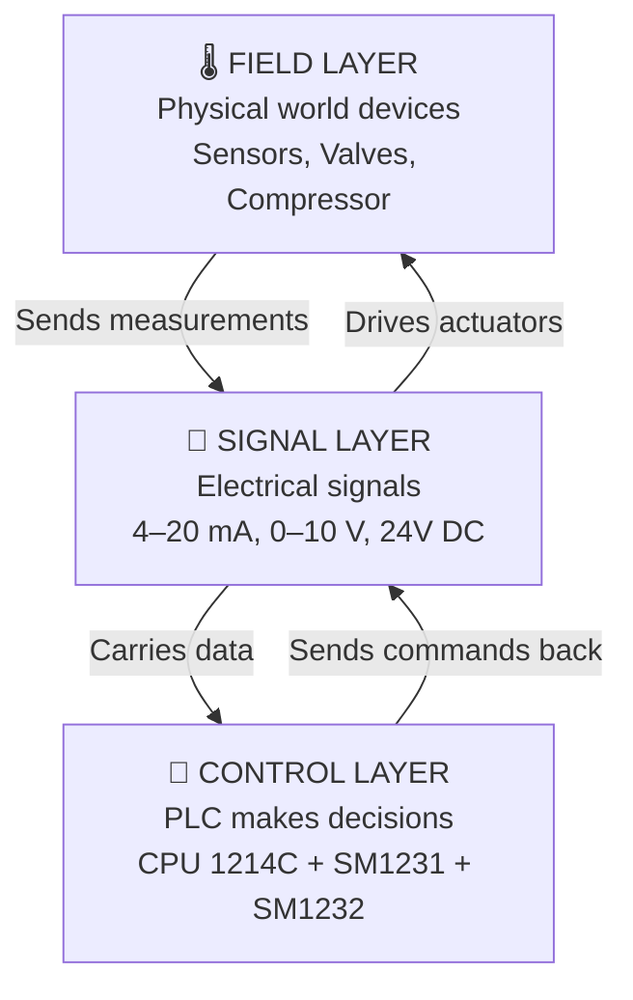

> **Key Insight:** Everything in this system is just **sending or receiving electrical signals**. Sensors send signals TO the PLC. The PLC sends signals TO valves and the VFD.

---

### What is 4–20 mA? (The Most Important Concept)

Almost every device here uses **4–20 mA current loop** signaling. Here's why and what it means:

| Current Value | Meaning |
|---|---|
| **4 mA** | 0% — Minimum (e.g., 0 bar pressure, 0°C temp, valve fully closed) |
| **12 mA** | 50% — Midpoint (e.g., 5 bar, half-open valve) |
| **20 mA** | 100% — Maximum (e.g., 10 bar, fully open valve) |
| **< 3.5 mA** | ⚠️ FAULT — Wire broken or sensor failed |

> **Why 4 mA and not 0 mA?** Starting at 4 mA (not 0) means the PLC can tell the difference between "sensor reads zero" and "wire is broken." A broken wire gives 0 mA, which is a fault condition. This is a critical safety feature.

---

## 2. Power Supply — The Foundation of Everything

### What you need

Every device in this system runs on **24V DC**. You need a **DIN-rail 24V DC power supply** rated at minimum **5 Amps** for a tabletop setup.

> **Recommended:** Siemens SITOP PSU100S 24V/5A or equivalent.

### Power Distribution Concept

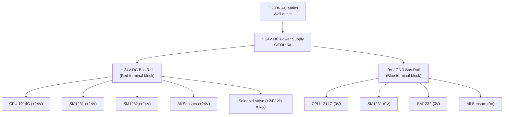

### Wiring the Power Supply

| Terminal on PSU | Wire Colour | Connect to |
|---|---|---|
| **L (Line)** | Brown | 230V AC Live |
| **N (Neutral)** | Blue | 230V AC Neutral |
| **PE (Earth)** | Green/Yellow | Earth/Ground |
| **+24V DC** | Red | + Bus rail / PLC +24V terminal |
| **0V (GND)** | Black or Blue | 0V bus rail / PLC 0V terminal |

> ⚠️ **Safety:** Always use a 6A circuit breaker on the 230V AC input. Never work on wiring while the system is powered.

---

## 3. The PLC CPU (Brain of the System)

### Siemens CPU 1214C — Terminal Overview

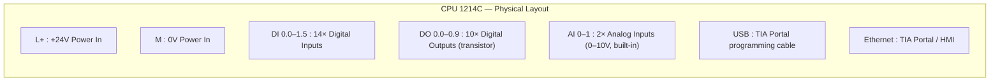

### CPU Power Connection

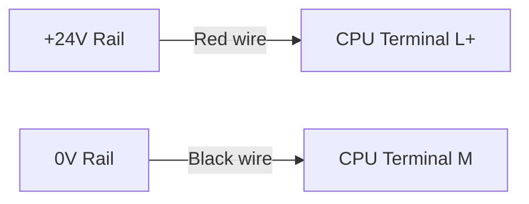

### Digital Outputs (DO) — How they work

The CPU has 10 digital outputs. Each output either provides **+24V** (ON) or **0V** (OFF). These are used to:
- Turn the solenoid valve ON/OFF
- Send Run/Stop commands to the VFD

| DO Terminal | Connected Device | Function |
|---|---|---|
| **DO 0.0** | VFD Run/Stop input | Starts/stops compressor |
| **DO 0.1** | Solenoid valve relay coil | Opens/closes safety valve |
| DO 0.2–0.9 | Spare | Available for future use |

### Digital Inputs (DI) — How they work

Digital inputs read ON/OFF signals coming back from field devices.

| DI Terminal | Connected Device | What it reads |
|---|---|---|
| **DI 0.0** | VFD fault relay | Is the VFD in fault? |
| DI 0.1–1.5 | Spare | Available |

---

## 4. Analog Input Module SM1231 — Reading Sensors

### What this module does

The SM1231 reads **analog (continuously varying) signals** from sensors and converts them into **numbers the PLC can process**. All sensors in this system output 4–20 mA signals.

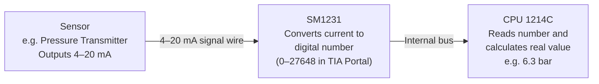

### Channel-by-Channel Assignment

| Channel | Terminal (+ / −) | Connected Sensor | Signal Type |
|---|---|---|---|
| **AI Ch0** | Pin 2 (+) / Pin 4 (−) | Pressure Transmitter 1 | 4–20 mA |
| **AI Ch1** | Pin 6 (+) / Pin 8 (−) | Pressure Transmitter 2 | 4–20 mA |
| **AI Ch2** | Pin 10 (+) / Pin 12 (−) | Pressure Transmitter 3 | 4–20 mA |
| **AI Ch3** | Pin 14 (+) / Pin 16 (−) | Pressure Transmitter 4 | 4–20 mA |
| **AI Ch4** | Pin 18 (+) / Pin 20 (−) | Temperature Transmitter 1 | 4–20 mA |
| **AI Ch5** | Pin 22 (+) / Pin 24 (−) | Temperature Transmitter 2 | 4–20 mA |
| **AI Ch6** | Pin 26 (+) / Pin 28 (−) | Flow Meter | 4–20 mA |
| **AI Ch7** | Pin 30 (+) / Pin 32 (−) | — Spare — | — |

### TIA Portal Configuration for SM1231

In TIA Portal software, for **each channel** set to:
- **Measurement type:** Current
- **Measurement range:** 4 mA to 20 mA
- **Enable overflow/underflow diagnostics:** Yes (detects broken wires)

---

## 5. Analog Output Module SM1232 — Sending Commands

### What this module does

The SM1232 does the **opposite** of SM1231. Instead of reading signals, it **outputs** analog signals to control valves and the VFD.

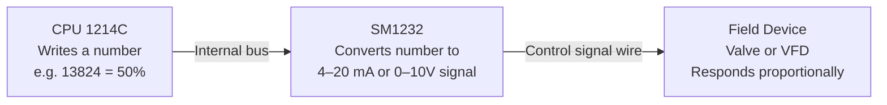

### Channel Assignment

| Channel | Terminal | Connected Device | Signal | Effect |
|---|---|---|---|---|
| **AO Ch0** | Pin 2 (+) / Pin 4 (−) | Proportional valve | 4–20 mA | Controls how open the valve is |
| **AO Ch1** | Pin 6 (+) / Pin 8 (−) | VFD Speed Reference | 4–20 mA or 0–10V | Controls compressor speed |

### TIA Portal Configuration for SM1232

For **AO Ch0** (Proportional Valve):
- **Output type:** Current
- **Output range:** 4 mA to 20 mA

For **AO Ch1** (VFD):
- **Output type:** Voltage (if VFD accepts 0–10V) or Current (4–20 mA)
- Match to what your VFD model requires

---

## 6. Pressure Transmitters (×4)

### Model: Endress+Hauser Cerabar PMP71

### What it does
A pressure transmitter converts physical gas pressure into a 4–20 mA signal. It is a **2-wire loop-powered device**, meaning it gets its power AND sends its signal over the **same two wires**.

### How 2-wire loop power works

> **Think of it this way:** The +24V pushes current around the loop. The transmitter controls HOW MUCH current flows (4–20 mA) based on the pressure it senses. The SM1231 measures that current.

### Wiring (Same for all 4 pressure transmitters)

| Wire | From | To | Colour |
|---|---|---|---|
| Wire 1 | +24V DC Bus Rail | Transmitter Terminal **+** | Red |
| Wire 2 | Transmitter Terminal **−** | SM1231 **Channel + input** | Blue or Brown |
| Wire 3 | SM1231 **Channel − input** | 0V / GND Bus Rail | Black |

> ⚠️ **Note:** Do NOT connect +24V directly to the SM1231. The +24V always goes to the transmitter first.

### Physical Installation Notes

| Spec | Requirement |
|---|---|
| Process connection | ¼" or ½" NPT/BSP — thread into your pipe fitting |
| Orientation | Vertical preferred; horizontal acceptable |
| Avoid | Heat sources, vibration, water pooling on electronics |
| Cable gland | Use IP67-rated cable gland into transmitter housing |

---

## 7. Temperature Sensors (×2)

### Setup: PT100 Probe + RTD Transmitter

Temperature measurement uses **two components together**:
1. **PT100 RTD Probe** — physically touches the gas/pipe and changes resistance with temperature
2. **Head-mounted RTD Transmitter** — converts resistance into 4–20 mA

### Why two components?

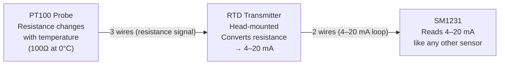

> The PLC's SM1231 can only read current (mA), not resistance. The transmitter does the conversion for us.

### PT100 to Transmitter Wiring (3-wire connection)

| PT100 Wire | Colour | Transmitter Terminal |
|---|---|---|
| Wire 1 (excitation) | Red | RTD+ or EXC |
| Wire 2 (sense) | White | RTD− or SIG |
| Wire 3 (compensation) | White | RTD COMP or SENSE |

> ⚠️ **3-wire vs 2-wire:** Always use 3-wire PT100 connection. The third wire compensates for the resistance of the cable itself, giving accurate readings over long distances.

### Transmitter to SM1231 Wiring (2-wire loop)

| Wire | From | To |
|---|---|---|
| Wire 1 | +24V Rail | Transmitter **+24V** terminal |
| Wire 2 | Transmitter **Output+** | SM1231 Channel+ |
| Wire 3 | SM1231 Channel− | 0V Rail |

### Transmitter Configuration

Before installation, configure the transmitter (via a PC tool or DIP switches):
- **Sensor type:** PT100
- **Connection:** 3-wire
- **Temperature range:** e.g., 0°C to 150°C → mapped to 4–20 mA

---

## 8. Flow Meter

### Model: Bronkhorst EL-FLOW Select (Thermal Mass Flow Meter)

### What it does
Measures how much gas (compressed air) is flowing through the pipe per unit time. Like the pressure transmitters, it outputs a **4–20 mA signal**.

### How thermal mass flow works

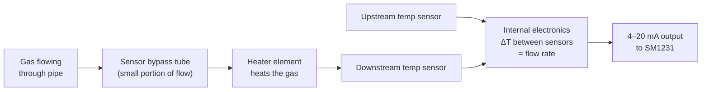

### Wiring

| Terminal on Flow Meter | Connect to |
|---|---|
| **+24V** (supply+) | +24V DC Rail |
| **0V / GND** (supply−) | 0V DC Rail |
| **Output+** (4–20 mA signal) | SM1231 AI Ch6 (+) |
| **Output−** (signal return) | SM1231 AI Ch6 (−) then to 0V |

> ⚠️ This is a **4-wire device** (separate power and signal wires), unlike the 2-wire loop-powered pressure transmitters.

### Zero and Span Calibration

The flow meter must be configured for your actual flow range. Example:
- **0 Nm³/h → 4 mA**
- **200 Nm³/h → 20 mA**

This is set using Bronkhorst's FlowDDE/FlowPlot software via RS232 or digitally.

---

## 9. Proportional Control Valve

### Model: Festo VPCF or VPPE

### What it does
This valve **continuously varies** how open it is — from 0% to 100% — based on the 4–20 mA command signal from the SM1232. It is the primary tool for controlling pressure or flow in the system.

### Control Signal Flow

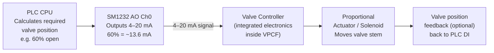

### Wiring

| Terminal on Valve | Connect to | Notes |
|---|---|---|
| **+24V** | +24V Rail | Powers integrated electronics |
| **0V / GND** | 0V Rail | Common ground |
| **Signal In +** (4–20 mA) | SM1232 AO Ch0 (+) | Control signal |
| **Signal In −** | SM1232 AO Ch0 (−) → 0V | Signal return |
| **Feedback Out +** (optional) | CPU DI input | Position confirmation |
| **Feedback Out −** (optional) | CPU DI − | Position return |

### Process Piping

- Install in pipeline with flow direction arrow pointing downstream
- Leave clearance above/below for maintenance
- Install isolation valves before and after for maintenance capability

---

## 10. Solenoid Shutoff Valve

### Model: ASCO 8210 Series

### What it does
This is a **simple ON/OFF valve** — either fully open or fully closed. It acts as the **safety shutoff**: when the PLC detects a fault or emergency, it immediately closes this valve to cut off compressed air.

> **Critical safety principle:** The valve is **Normally Closed (NC)**. This means when power is lost (emergency, power failure), the valve AUTOMATICALLY CLOSES. This is a fundamental safety design principle called "fail-safe."

### Why we use an Interposing Relay

The PLC's digital output (DO) can only supply low current. The solenoid valve coil needs more current to operate. An **interposing relay** (or solid-state relay) acts as an amplifier:

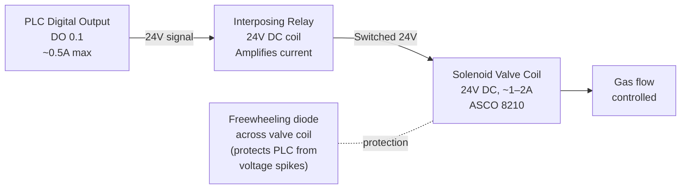

### Wiring

| Step | Terminal | Connect to | Notes |
|---|---|---|---|
| **1** | PLC DO 0.1 (+) | Relay coil terminal A1 | PLC controls relay |
| **2** | Relay coil terminal A2 | 0V Rail | Relay coil return |
| **3** | +24V Rail | Relay common terminal (COM) | Power for valve |
| **4** | Relay NO terminal | Valve coil + terminal | Switched power to valve |
| **5** | Valve coil − terminal | 0V Rail | Valve coil return |
| **6** | Freewheeling diode | Across valve coil terminals | Cathode to + side |

> ⚠️ **ALWAYS fit a freewheeling diode across the solenoid coil.** When the valve switches off, the coil produces a voltage spike that can damage the PLC output transistor. The diode absorbs this spike.

---

## 11. Variable Frequency Drive (VFD) + Compressor

### Model: Siemens SINAMICS V20

### What it does
The VFD controls the **speed of the electric motor** in the compressor. By varying speed, we control how much compressed air is generated — without wasting energy running the motor at full speed all the time.

### VFD Connection Overview

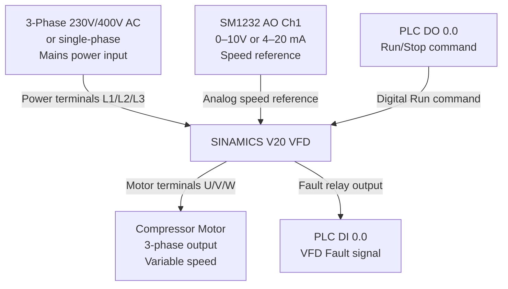

### VFD Terminal Wiring Detail

| VFD Terminal | Connect to | Wire | Purpose |
|---|---|---|---|
| **L / L1** | Mains 230V Line | Brown | AC Power in |
| **N / L2** | Mains Neutral | Blue | AC Power in |
| **PE** | Earth | Green/Yellow | Safety earth |
| **U, V, W** | Motor terminals U, V, W | Motor cable | Power to motor |
| **PE (motor side)** | Motor earth | Green/Yellow | Motor earth |
| **+10V ref** | Internal (don't connect) | — | VFD's own reference |
| **AI1 (analog in +)** | SM1232 AO Ch1 (+) | — | Speed reference signal |
| **AI1 (analog in −)** | SM1232 AO Ch1 (−) → 0V | — | Signal return |
| **DI1 (Run/Stop)** | PLC DO 0.0 | — | Start/Stop command |
| **DIC (DI common)** | 0V Rail | — | Digital input common |
| **RL1A, RL1C** | PLC DI 0.0 | — | Fault relay output |

### VFD Configuration Parameters (P-numbers in V20)

| Parameter | Value | Description |
|---|---|---|
| **P0700** | 2 | Command source = terminal strip |
| **P1000** | 2 | Frequency setpoint = analog input AI1 |
| **P0756** | 0 or 2 | AI1 type: 0 = 0–10V, 2 = 4–20 mA |
| **P1080** | 0 Hz | Minimum frequency |
| **P1082** | 50 Hz | Maximum frequency |
| **P0304** | Your motor rated voltage | e.g. 230 V |
| **P0305** | Your motor rated current | From motor nameplate |
| **P0307** | Your motor rated power | e.g. 0.37 kW |
| **P0310** | Your motor rated frequency | 50 Hz |
| **P0311** | Your motor rated speed | e.g. 1400 RPM |

> ⚠️ **Always run the V20 motor auto-tune** after entering motor data (P1900 = 1). This improves motor control accuracy.

---

## 12. Complete System Wiring Diagram

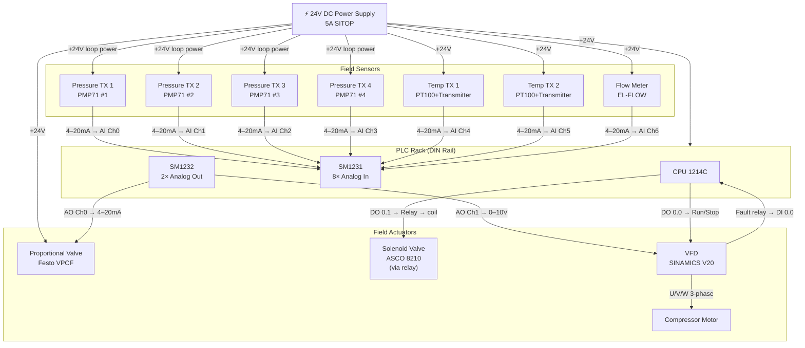

---

## 13. Signal Flow Overview

### Full Data Journey: Sensor → PLC → Action

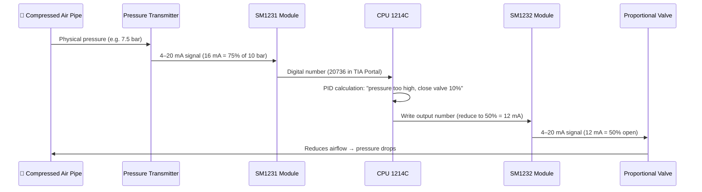

### Emergency Shutdown Sequence

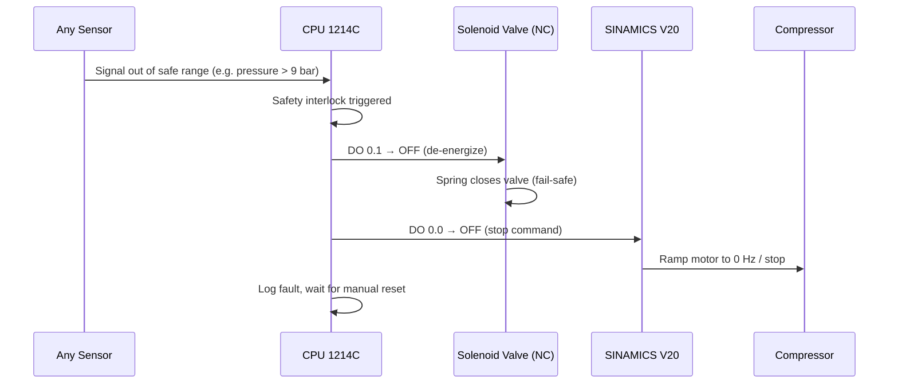

---

## 14. Safety Rules for Industrial Critical Systems

> These are not optional. In an industrial critical system, mistakes can cause injury, equipment damage, or process failure.

### Electrical Safety

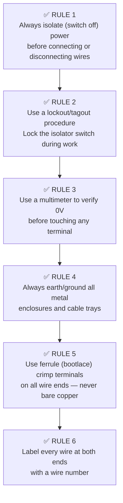

### System Safety Design Rules

| Rule | Why |
|---|---|
| **Solenoid valve must be Normally Closed (NC)** | Power failure = valve closes = safe state |
| **PLC watchdog timer must be enabled** | If PLC software crashes, outputs go to safe state |
| **Emergency stop button wired in hardware** | Must cut power independently of PLC software |
| **Pressure relief valve on pipeline** | Mechanical last resort — no electronics involved |
| **VFD fault must trigger shutdown in PLC** | Do not ignore VFD faults |
| **Use shielded cable for all 4–20 mA signals** | Prevents electrical noise corrupting readings |

### Cable and Wire Selection

| Signal Type | Cable Type | Max Length |
|---|---|---|
| 4–20 mA analog signal | Shielded twisted pair (STP), 0.5–1.0 mm² | Up to 500m |
| 0–10 V analog signal | Shielded twisted pair (STP), 0.5 mm² | Max 10–50m |
| 24V DC power | Single core, 1.0–2.5 mm² (depending on current) | Per voltage drop calc |
| VFD to motor | Shielded motor cable, 4-core | As short as possible |
| PLC to VFD signal | Shielded cable | Keep away from motor cable |

> ⚠️ **Never run 4–20 mA signal cables alongside 230V AC or motor cables.** Electrical interference will corrupt your sensor readings.

---

## 15. Quick Reference Wiring Table

| Device | Device Terminal | PLC/Module Terminal | Wire Type | Notes |
|---|---|---|---|---|
| **Pressure TX 1** | TX + | +24V Rail | Red, 1mm² | Loop power |
| **Pressure TX 1** | TX − | SM1231 AI Ch0 + | Blue, 0.5mm² shielded | Signal |
| **Pressure TX 1** | SM1231 AI Ch0 − | 0V Rail | Black, 0.5mm² | Return |
| **Pressure TX 2** | Same pattern | SM1231 AI Ch1 +/− | As above | — |
| **Pressure TX 3** | Same pattern | SM1231 AI Ch2 +/− | As above | — |
| **Pressure TX 4** | Same pattern | SM1231 AI Ch3 +/− | As above | — |
| **Temp TX 1** | TX +24V in | +24V Rail | Red, 1mm² | Power |
| **Temp TX 1** | TX Output+ | SM1231 AI Ch4 + | Blue, 0.5mm² shielded | Signal |
| **Temp TX 1** | TX Output− / 0V | 0V Rail | Black, 0.5mm² | Return |
| **Temp TX 2** | Same pattern | SM1231 AI Ch5 +/− | As above | — |
| **Flow Meter** | FM +24V | +24V Rail | Red, 1mm² | Power |
| **Flow Meter** | FM 0V | 0V Rail | Black, 1mm² | Power return |
| **Flow Meter** | FM Output+ | SM1231 AI Ch6 + | Blue, 0.5mm² shielded | Signal |
| **Flow Meter** | FM Output− | SM1231 AI Ch6 − → 0V | Black, 0.5mm² | Signal return |
| **Prop. Valve** | Valve +24V | +24V Rail | Red, 1mm² | Power |
| **Prop. Valve** | Valve 0V | 0V Rail | Black, 1mm² | Power return |
| **Prop. Valve** | Valve Signal In+ | SM1232 AO Ch0 + | Blue, 0.5mm² shielded | Control signal |
| **Prop. Valve** | Valve Signal In− | SM1232 AO Ch0 − → 0V | Black, 0.5mm² | Signal return |
| **Solenoid Valve** | Coil + | Relay NO terminal | Red, 1mm² | Via relay |
| **Solenoid Valve** | Coil − | 0V Rail | Black, 1mm² | Coil return |
| **Relay coil A1** | — | PLC DO 0.1 | 0.5mm² | DO triggers relay |
| **Relay coil A2** | — | 0V Rail | 0.5mm² | DO return |
| **Relay COM** | — | +24V Rail | Red, 1mm² | Switched power source |
| **VFD AI1+** | — | SM1232 AO Ch1 + | Shielded, 0.5mm² | Speed reference |
| **VFD AI1−** | — | SM1232 AO Ch1 − → 0V | Shielded, 0.5mm² | Signal return |
| **VFD DI1** | Run/Stop | PLC DO 0.0 | 0.5mm² | Run command |
| **VFD DIC** | DI Common | 0V Rail | 0.5mm² | DI return |
| **VFD RL1A/RL1C** | Fault relay | PLC DI 0.0 | 0.5mm² | Fault feedback |

---

## ✅ Commissioning Checklist

Before powering up for the first time:

- [ ] All power terminals checked for correct polarity (+/−)
- [ ] All analog signal cables are shielded and shield connected at ONE end only (PLC end)
- [ ] Freewheeling diode fitted across solenoid valve coil
- [ ] Motor cable is separate from signal cables
- [ ] All wire ends have ferrule crimp terminals
- [ ] All wires labelled at both ends
- [ ] TIA Portal: SM1231 channels configured for 4–20 mA input
- [ ] TIA Portal: SM1232 channels configured for 4–20 mA or 0–10V output
- [ ] VFD motor parameters entered and auto-tune completed
- [ ] Emergency stop button tested — cuts power independently
- [ ] Pressure relief valve present and set correctly
- [ ] All enclosure doors closed and bolted before applying 230V AC

---

*Guide prepared for tabletop industrial PLC setup — Siemens S7-1200 platform.*
*Always consult official Siemens, Endress+Hauser, Bronkhorst, Festo, ASCO, and Siemens V20 documentation for exact terminal designations on your specific hardware revisions.*
