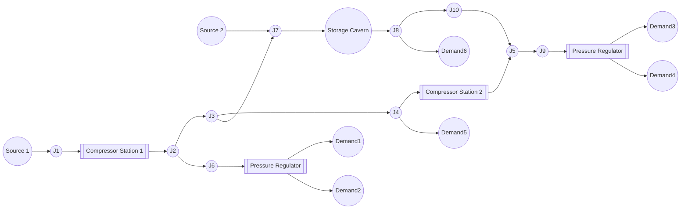
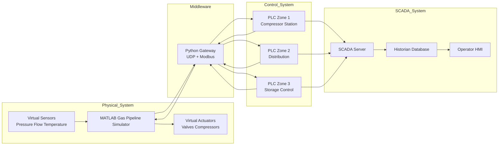
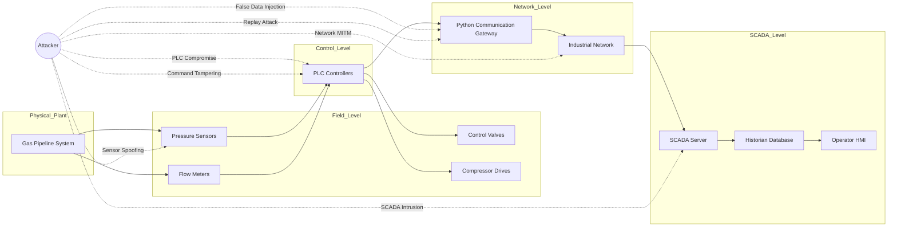

Below are **three professional diagrams** you can directly include in your **project documentation, thesis, or GitHub README**.
They are written in **Mermaid**, which renders automatically in **GitHub, MkDocs, Obsidian, and many Markdown viewers**.

These diagrams represent:

1️⃣ **GasLib-24 inspired pipeline network (20 nodes)**
2️⃣ **Complete ICS cyber-physical architecture**
3️⃣ **Attack Surface Map (standard diagram used in ICS security research)**

---

# 1. GasLib-24 Inspired Pipeline Network (20 Nodes)

This diagram represents a **transmission-level gas network** with:

* 2 supply sources
* 2 compressor stations
* 1 underground storage cavern
* pressure regulating stations
* multiple demand nodes
* branching + loop topology



### Why this topology matters

It introduces realistic features:

* **loop flows**
* **multi-source balancing**
* **bidirectional storage flow**
* **pressure drop across regulators**

This prevents ML models from **memorizing topology**, improving research quality.

---

# 2. Complete ICS Network Architecture

This diagram shows the **cyber-physical architecture of the system**.

It includes:

* MATLAB physical simulator
* Python gateway
* CODESYS PLC controllers
* SCADA system
* historian database



### What this diagram shows

Real industrial pipelines operate exactly like this:

```
field devices → PLCs → SCADA → historian
```

Your simulator recreates the **same architecture**.

---

# 3. ICS Attack Surface Map (Critical for Research Papers)

This diagram shows **where attackers can intervene in the system**.

This type of diagram is extremely common in:

* ICS cybersecurity papers
* industrial threat modeling
* digital twin security research



---

# Why This Diagram is Important

It clearly identifies attack categories:

| Attack Type          | Target           |
| -------------------- | ---------------- |
| Sensor spoofing      | sensors          |
| False data injection | gateway          |
| Replay attack        | network          |
| PLC compromise       | PLC              |
| SCADA intrusion      | SCADA            |
| Command tampering    | actuator control |

This helps explain **where your attacks A1–A10 occur**.

---

# Recommended Usage in Your Documentation

Use the diagrams like this:

```
docs/
  architecture.md
  pipeline_network.md
  attack_surface.md
```

Or in a thesis:

```
Chapter 3 – System Architecture
    Fig 3.1 Pipeline Network
    Fig 3.2 Cyber Physical Architecture
    Fig 3.3 Attack Surface Map
```

---

💡 If you'd like, I can also generate **one more extremely powerful diagram** used in many cyber-physical research papers:

**The "Data Flow of a Single Simulation Step" diagram**

It shows:

```
Physics → Sensors → PLC → Control → Actuators → Physics
```

This makes the **entire system operation instantly understandable**.
