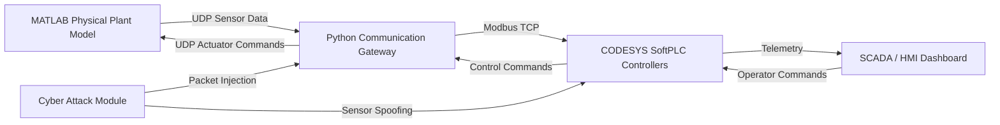
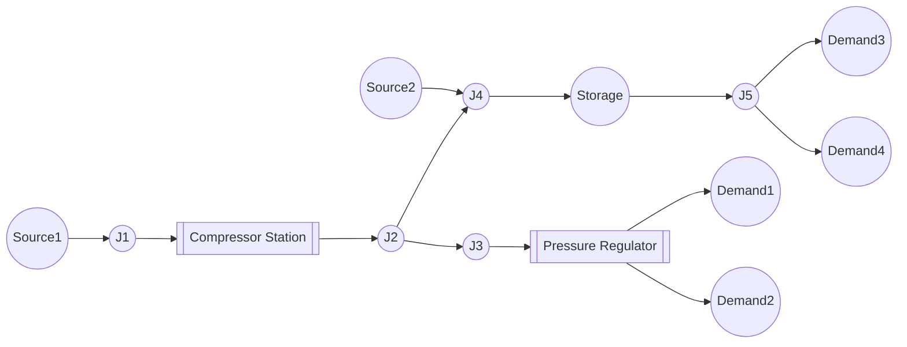
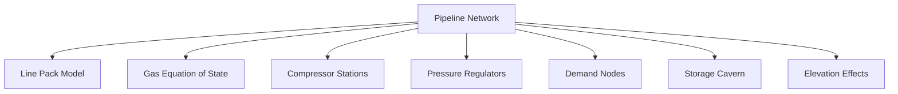
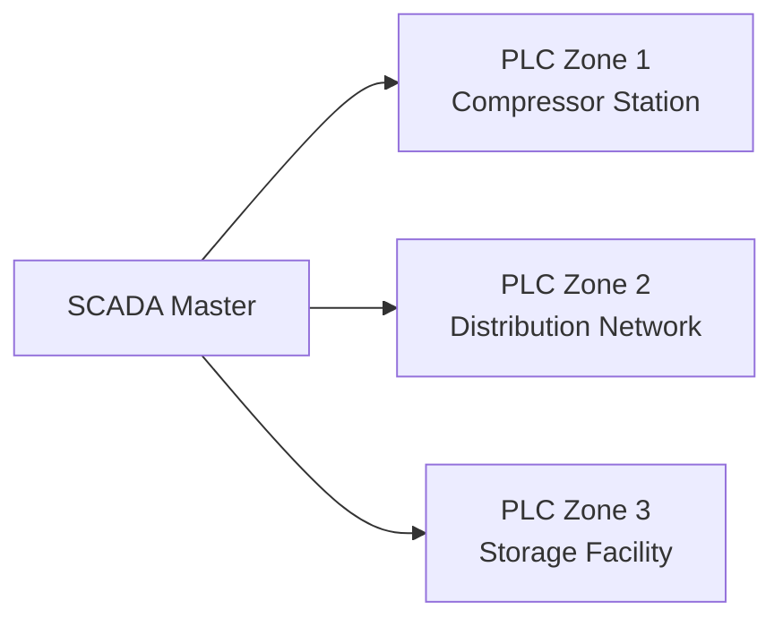
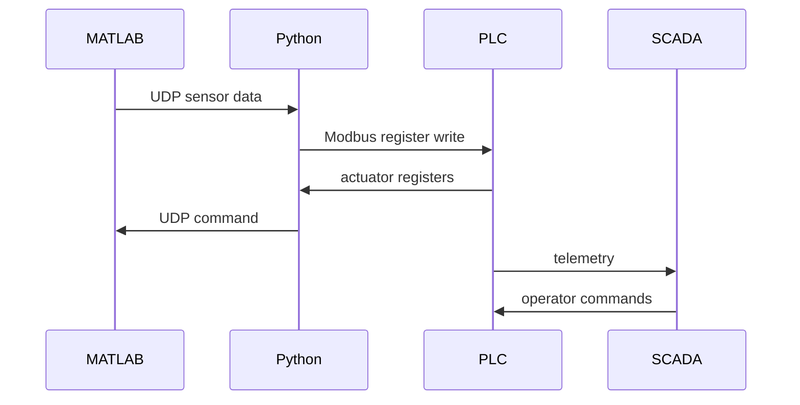
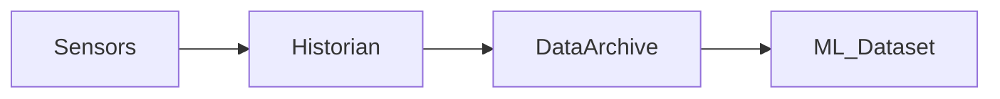
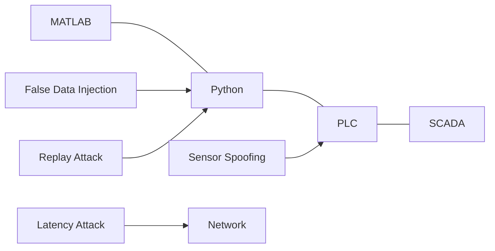
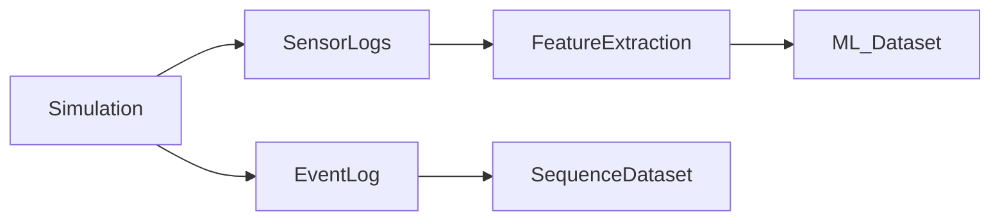

Below is a **`system_architecture.md`** document with **clear diagrams using Mermaid**.
You can place this file directly in your repo for **documentation, papers, or GitHub README**.

It shows:

* Cyber-physical architecture
* Communication flow
* GasLib-style network topology
* PLC zones
* Attack injection points
* Data pipeline for ML

---

# Gas Pipeline Cyber-Physical Simulation

# System Architecture

---

# 1. Overview

This system simulates a **cyber-physical natural gas pipeline network** with realistic industrial control architecture.

The architecture separates the system into **five interacting layers**:

1. Physical pipeline model (MATLAB)
2. PLC control system (CODESYS SoftPLC)
3. Communication middleware (Python Gateway)
4. SCADA / HMI monitoring system
5. Cyber attack module

The design mirrors real industrial gas pipeline infrastructure and supports **cyber-security research and machine learning dataset generation**.

---

# 2. High Level Cyber-Physical Architecture



---

# 3. Physical Pipeline Network (GasLib-Style)

The physical model simulates a **GasLib-inspired transmission network** with expanded topology.

### Network characteristics

* 15-20 nodes
* multiple supply sources
* compressor stations
* storage nodes
* pressure regulating stations
* branching pipelines

---

## Example Network Topology



---

# 4. Physical Model Components

The MATLAB plant model contains the following subsystems.



---

## Line Pack Dynamics

Each pipe stores gas mass.

```
dM/dt = inflow − outflow
```

This creates **pressure propagation delays** across the network.

---

## Gas Equation of State

Two models supported.

**Ideal Gas**

```
ρ = P / RT
```

**Peng-Robinson**

```
ρ = P / (ZRT)
```

Where **Z** is compressibility factor.

---

# 5. PLC Control Architecture

The control system is **distributed across multiple PLC zones**.



Each PLC runs independent control loops.

### Typical PLC functions

```
compressor PID control
pressure regulation
valve interlocks
surge protection
flow balancing
```

---

# 6. Communication Flow

The communication system simulates real industrial protocols.



---

# 7. SCADA Historian Layer

The historian introduces realistic industrial telemetry behavior.



Features:

* deadband filtering
* scan-rate sampling
* timestamp jitter
* data compression

Example rule

```
log new value only if |value change| > threshold
```

---

# 8. Cyber Attack Injection Points

Cyber attacks may occur at several locations.



---

# 9. Attack Scenarios

The simulation supports **10 attack types**.

| ID  | Attack                       |
| --- | ---------------------------- |
| A1  | Source Pressure Manipulation |
| A2  | Compressor Ratio Spoofing    |
| A3  | Valve Command Tampering      |
| A4  | Demand Node Manipulation     |
| A5  | Pressure Sensor Spoofing     |
| A6  | Flow Meter Spoofing          |
| A7  | PLC Latency Attack           |
| A8  | Pipeline Leak                |
| A9  | False Data Injection         |
| A10 | Replay Attack                |

---

# 10. Data Generation Pipeline

Simulation outputs are converted into ML-ready datasets.



---

## Time Series Dataset

Columns include

```
timestamp
node_pressure
node_temperature
pipe_flow
compressor_state
valve_position
```

---

## Event Dataset

Events include

```
attack_start
attack_end
alarm_trigger
compressor_surge
valve_change
PLC_fault
```

---

# 11. System Folder Structure

Example repository layout.

```
simulation/

physical_model/
    updateNetworkPhysics.m
    updateLinepack.m
    updateCompressors.m

control/
    plc_logic.st
    control_loops.m

middleware/
    gateway.py
    modbus_client.py

attacks/
    attack_engine.py
    computeFDIVector.m

config/
    config.yaml

logs/
    telemetry/
    events/
```

---

# 12. Key Research Capabilities

This architecture enables research on:

* ICS cyber-security
* anomaly detection
* digital twin systems
* industrial control resilience
* cyber-physical attack detection
* ML-based fault diagnosis

---

# 13. Summary

The upgraded simulation system provides:

* realistic **gas pipeline physics**
* **GasLib-scale network topology**
* distributed **PLC control architecture**
* realistic **SCADA telemetry**
* advanced **cyber attack simulation**

The resulting datasets are suitable for:

* machine learning
* anomaly detection
* cyber-security research
* digital twin validation


# 14. Implementation of Inter-System Communication

This section defines how the different system components communicate to form a working cyber-physical simulation.

The system uses **two communication layers**:

1. **UDP socket communication**
2. **Modbus/TCP industrial protocol**

These are widely used in industrial ICS research environments.

---

# 14.1 MATLAB ↔ Python Communication

MATLAB acts as the **physical plant simulator**, while Python acts as a **middleware gateway**.

Communication uses **UDP sockets**.

## Why UDP

Advantages:

* low latency
* simple packet format
* easy integration
* MATLAB supports it natively

---

## Data Flow

```
MATLAB → sensor data → Python
Python → actuator commands → MATLAB
```

---

## MATLAB UDP Sender (Sensor Data)

MATLAB sends simulated sensor data to Python.

Example MATLAB code:

```matlab
u = udpport("datagram");

pythonIP = "127.0.0.1";
pythonPort = 5005;

sensorData = [pressure flow temperature valveState];

write(u, sensorData, "double", pythonIP, pythonPort);
```

This sends the pipeline state to Python every simulation step.

---

## MATLAB UDP Receiver (Actuator Commands)

MATLAB receives control commands from Python.

```matlab
u = udpport("datagram","LocalPort",6006);

if u.NumBytesAvailable > 0
    cmd = read(u,u.NumBytesAvailable,"double");

    valvePosition = cmd(1);
    compressorSpeed = cmd(2);
end
```

MATLAB then applies these commands to the plant model.

---

# 14.2 Python Gateway (Middleware)

Python acts as the **protocol bridge** between MATLAB and the PLC.

Responsibilities:

* receive UDP data from MATLAB
* convert values into Modbus registers
* write registers to PLC
* read PLC outputs
* send commands back to MATLAB

---

## Required Python Libraries

Install:

```
pip install pymodbus
pip install pyyaml
pip install numpy
```

---

## Python UDP Server

Example code:

```python
import socket
import struct

UDP_IP = "0.0.0.0"
UDP_PORT = 5005

sock = socket.socket(socket.AF_INET, socket.SOCK_DGRAM)
sock.bind((UDP_IP, UDP_PORT))

data, addr = sock.recvfrom(1024)

values = struct.unpack("dddd", data)
```

---

# 14.3 Python ↔ CODESYS Communication

Python communicates with CODESYS using **Modbus/TCP**.

CODESYS acts as a **Modbus server**.

Python acts as the **Modbus client**.

---

## Enable Modbus in CODESYS

Steps in CODESYS IDE:

1. Add device
2. Add **Modbus TCP Server**
3. Configure registers

Example mapping:

| Register | Variable      |
| -------- | ------------- |
| 40001    | pressure      |
| 40002    | flow          |
| 40003    | temperature   |
| 40004    | valve command |

---

## Python Modbus Client Example

```python
from pymodbus.client import ModbusTcpClient

client = ModbusTcpClient("127.0.0.1", port=502)

client.connect()

client.write_register(1, pressure)
client.write_register(2, flow)

result = client.read_holding_registers(10,2)

valve_cmd = result.registers[0]
compressor_cmd = result.registers[1]
```

---

# 14.4 Python → MATLAB Command Return

Python converts PLC output registers into actuator commands.

Example:

```python
cmd = struct.pack("dd", valve_cmd, compressor_cmd)

sock.sendto(cmd, ("127.0.0.1",6006))
```

---

# 14.5 Complete Runtime Data Flow

The complete system loop executes as follows:

```
Step 1
MATLAB computes pipeline physics

Step 2
MATLAB sends sensor values to Python

Step 3
Python writes values into PLC registers

Step 4
PLC executes control logic

Step 5
Python reads actuator registers

Step 6
Python sends commands back to MATLAB

Step 7
MATLAB updates valves/compressors
```

---

# 14.6 System Timing

Typical control cycle:

| Component              | Cycle Time |
| ---------------------- | ---------- |
| MATLAB simulation step | 1 sec      |
| Python gateway         | 100 ms     |
| PLC scan cycle         | 50 ms      |
| SCADA refresh          | 1 sec      |

---

# 14.7 Configuration Mapping

The system uses a configuration file:

```
config.yaml
```

Example:

```yaml
sensors:
  pressure_J1: 40001
  pressure_J2: 40002
  flow_E1: 40003

actuators:
  valve_E4: 40101
  compressor_C1: 40102
```

This ensures consistent mapping between:

```
MATLAB variables
Python middleware
PLC registers
```

---

# 14.8 Cyber Attack Injection

Attacks may modify messages at the Python gateway.

Example spoofing:

```
pressure_fake = pressure + random_noise
```

Replay attack:

```
send recorded sensor values instead of live data
```

Latency attack:

```
delay packets before forwarding
```

---

# 14.9 System Deployment

Recommended execution order:

```
1 start CODESYS runtime
2 start Python gateway
3 start MATLAB simulation
4 open SCADA dashboard
```

---

# 14.10 Testing Procedure

Initial integration testing steps:

1. Verify UDP communication between MATLAB and Python.
2. Verify Modbus register read/write with CODESYS.
3. Run simple valve command loop.
4. Validate pressure response in MATLAB.

---

# Result

This communication architecture allows the system to behave like a **real industrial control system**, with:

* realistic protocols
* distributed control
* cyber attack injection capability
* scalable network topology

---

If you want, I can also show you **one extremely useful diagram** that almost every ICS research paper uses:

**The "Attack Surface Map" of the pipeline system**

It shows **exactly where attackers can intervene** (sensor spoofing, PLC compromise, SCADA compromise, network MITM).

That diagram will make your **architecture 10× clearer**.
